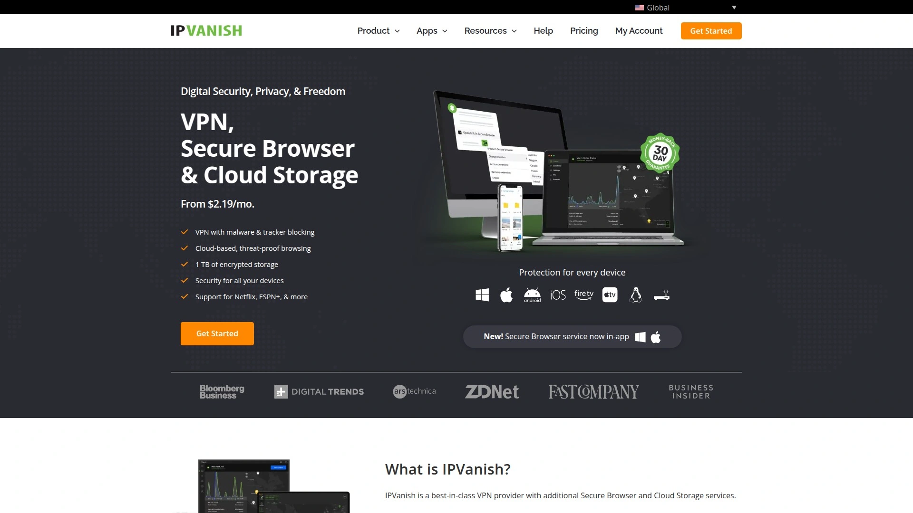
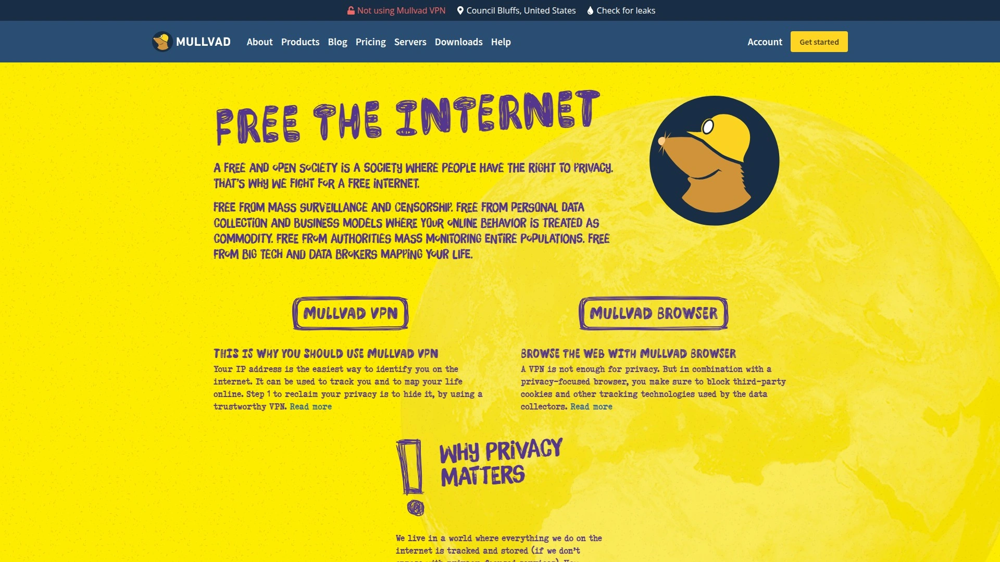
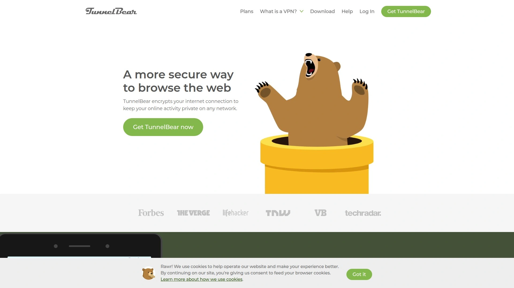

# No More Geo-Blocks! Recommend 11 Privacy-Protecting Game-Changers!

Your favorite show just dropped its new season, but clicking play gives you that dreaded "not available in your region" message. Or you're traveling and suddenly can't access your banking app because your IP address looks suspicious. Maybe you're just tired of your internet provider knowing every site you visit and selling that data to whoever pays. The internet promised freedom, but geo-restrictions, surveillance, and data harvesting turned it into a monitored maze where your location determines what content you see and your privacy gets auctioned to advertisers.

VPN services restore internet freedom by encrypting your connection and routing traffic through secure servers worldwide. The right VPN unblocks streaming content from any country, protects sensitive data on public WiFi, and keeps browsing activity private from ISPs and governments. These tools deliver faster speeds than many local connections, military-grade encryption that actually works, and server networks spanning every continent.

***

## **[PrivateVPN](https://privatevpn.com)**

Swedish privacy-focused provider balancing strong security with streaming performance.

PrivateVPN operates under Sweden's strict privacy laws, meaning zero traffic logging policies backed by legal framework rather than just marketing promises. The 2048-bit encryption with AES-256 provides military-grade security stronger than most competitors using standard 128-bit. This encryption level makes intercepting your data virtually impossible, even for sophisticated adversaries.

The platform supports 10 simultaneous device connections, more than most premium services capping at 5-6 devices. This matters for households with multiple phones, laptops, tablets, and smart TVs all needing protection. Port forwarding comes standard, essential for torrenting without speed throttling from ISPs. The network spans 63 countries with 200+ servers, covering major regions while maintaining manageable infrastructure for consistent performance.

Setup takes under 60 seconds with one-click installation across Windows, Mac, iOS, Android, and Linux. No coding required, no complex configuration menus—just download, click connect, and you're protected. The remote installation support handles technical issues directly rather than pointing you to help articles. Actual in-house developers troubleshoot problems through live chat, not outsourced virtual assistants reading scripts.

Unlimited bandwidth means no data caps slowing you down mid-month. Streaming HD video works smoothly, often faster than unprotected connections due to bypassing ISP throttling. The 30-day money-back guarantee provides genuine risk-free testing. For users wanting Swedish privacy protection, generous device limits, and hands-on support without enterprise pricing, PrivateVPN delivers professional-grade security at accessible costs.

***

## **[NordVPN](https://nordvpn.com)**

Industry-leading network with 8,200+ servers and proprietary NordLynx protocol.

NordVPN maintains the largest server infrastructure among major providers—8,200+ servers across 120+ countries—ensuring you always find fast nearby connections. The proprietary NordLynx protocol builds on WireGuard foundations, delivering speeds consistently topping independent test results while maintaining strong encryption. This protocol optimization means less speed loss compared to older OpenVPN implementations.

Threat Protection blocks ads, trackers, and malware automatically when connected, cleaning up your browsing experience without separate browser extensions. The CyberSec feature stops you from accessing known malicious sites before threats load. Double VPN routes traffic through two servers for extreme privacy when you need maximum anonymity. Meshnet creates secure private networks between devices, useful for remote access without exposing home systems to the internet.

The strict no-logs policy undergoes annual third-party audits by PricewaterhouseCoopers, providing verified proof rather than just company claims. Based in Panama, NordVPN operates outside intelligence-sharing alliances like Five Eyes and Fourteen Eyes. Obfuscated servers disguise VPN traffic as normal HTTPS, bypassing VPN blocks in restrictive countries.

Pricing starts around $3 monthly on long-term plans. Six simultaneous connections cover most household needs. The platform excels at unblocking Netflix, BBC iPlayer, Disney+, and other streaming services that aggressively block VPNs. For users wanting maximum server options, audited privacy, and consistently fast speeds, NordVPN justifies its premium positioning through actual performance rather than just marketing.

***

## **[ExpressVPN](https://expressvpn.com)**

Premium service emphasizing ease-of-use with servers in 105 countries.

ExpressVPN delivers the most polished user experience in the VPN market—interfaces feel intuitive whether you're technical or complete beginner. The proprietary Lightway protocol uses WolfSSL cryptography, passing three independent audits by KPMG. This protocol connects faster than OpenVPN while using less battery on mobile devices, important for always-on protection without draining phones.

Server network spans 105 countries including all 50 US states, useful for accessing local sports broadcasts and state-specific content. The split tunneling feature lets you route specific apps through the VPN while others connect normally, helpful when you need local banking access while protecting other traffic. MediaStreamer provides Smart DNS functionality for devices that don't support VPN apps directly, like some smart TVs and game consoles.

TrustedServer technology runs all servers on RAM only, wiping data with every reboot. This architecture makes retaining logs technically impossible rather than just policy-based. The 24/7 live chat support consistently receives high marks for actually solving problems quickly. Post-quantum encryption in development prepares for future threats from quantum computing before they become practical concerns.

The cost runs higher—$13 monthly for basic plans—reflecting premium positioning. However, the user-friendliness, server distribution, and customer support quality justify costs for users prioritizing hassle-free operation over budget pricing. Eight device connections balance individual and small family needs. For users wanting absolutely reliable streaming access and beginner-friendly design backed by strong security, ExpressVPN delivers polish competitors can't match.

***

## **[Surfshark](https://surfshark.com)**

Budget-friendly unlimited-device VPN with surprisingly robust feature set.

Surfshark provides unlimited simultaneous connections, rare among VPNs and genuinely useful for large families or users with many devices. At $1.99 monthly on two-year plans, it undercuts competitors significantly while delivering features typically reserved for premium tiers. This value proposition makes Surfshark perfect for budget-conscious users refusing to compromise on core functionality.

CleanWeb blocks ads, trackers, malware, and phishing attempts across all devices connected through the VPN. NoBorders mode bypasses VPN detection in restrictive countries, automatically enabling obfuscation when needed. Camouflage mode hides VPN usage from your ISP entirely, making traffic appear like normal HTTPS connections. MultiHop routes connections through two countries simultaneously for enhanced privacy.

The WireGuard protocol delivers fast speeds in testing, often matching or exceeding OpenVPN performance. Cookie pop-up blocker handles those annoying consent requests automatically. RAM-only servers match premium competitors' security architecture. The network covers 100+ countries with 3,200+ servers, substantial though smaller than NordVPN's infrastructure.

Independent audits by Cure53 verify no-logs claims and security implementations. Kill switch and DNS leak protection come standard. Browser extensions for Chrome and Firefox provide lightweight protection when full app isn't needed. For users wanting maximum device coverage and premium features at entry-level pricing, Surfshark makes strong security accessible without recurring budget strain.

***

## **[ProtonVPN](https://protonvpn.com)**

Privacy-first Swiss provider with excellent free tier and open-source apps.

ProtonVPN comes from the ProtonMail team, inheriting their privacy-focused philosophy and Swiss legal jurisdiction. The free tier provides genuinely usable VPN service—no data caps, no speed throttling, just limited to 3 server locations. This makes ProtonVPN ideal for testing VPN concepts before committing money or maintaining basic privacy on tight budgets.

Open-source apps across all platforms let security researchers verify implementation rather than trusting closed code. This transparency builds confidence that no backdoors exist. Secure Core architecture routes traffic through privacy-friendly countries before exiting to final destination, protecting against network surveillance. VPN Accelerator technology boosts speeds up to 400% on long-distance connections through performance optimizations.

NetShield blocks ads, malware, and trackers at network level. The Stealth protocol bypasses VPN blocking in restrictive networks. Swiss jurisdiction provides some of world's strongest privacy protections, free from intelligence-sharing agreements. Independent audits by Mozilla partner OSTIF verify security claims.

Pricing runs mid-range—$4.49 monthly for two-year plans. Ten simultaneous connections match most competitors. The platform particularly excels at protecting journalists, activists, and privacy advocates needing maximum security. For users prioritizing transparent code, Swiss privacy laws, and legitimate free options, ProtonVPN delivers principled security beyond just commercial service.

***

## **[Private Internet Access](https://privateinternetaccess.com)**

Veteran US-based provider with proven no-logs policy tested in court.

Private Internet Access (PIA) operates since 2010, giving it longer track record than most competitors. Unlike many VPN providers claiming no-logs policies, PIA proved theirs in actual court cases—subpoenaed multiple times, they couldn't provide user data because none existed. This real-world validation beats marketing claims every time.

The network includes 30,000+ servers, substantially larger than competitors, though server count alone doesn't guarantee performance. Unlimited device connections remove capacity concerns for power users or large households. The interface provides granular control over encryption levels, protocol selection, and security features—appreciated by technical users wanting customization.

MACE blocks ads, trackers, and malware at DNS level. Split tunneling works across Windows, Mac, Android, and iOS. Port forwarding supports torrenting optimization. WireGuard protocol delivers modern speeds. The US jurisdiction concerns some privacy advocates, though PIA's court-tested no-logs policy demonstrates actual practice matters more than headquarters location.

Pricing starts at $2.03 monthly on two-year plans, competitive with budget providers while maintaining established reputation. Browser extensions provide lightweight protection for Chrome, Firefox, and Opera. For users wanting proven privacy protection backed by court records rather than just audits, PIA transforms US jurisdiction from liability into evidence of genuine commitment.

***

## **[CyberGhost](https://cyberghostvpn.com)**

Beginner-friendly Romanian provider with specialized streaming and torrenting servers.

CyberGhost simplifies VPN selection through servers optimized for specific tasks—streaming Netflix, torrenting, gaming—rather than just geographic locations. This approach helps non-technical users pick appropriate servers without understanding infrastructure details. The interface emphasizes clarity over customization, perfect for users wanting protection without learning VPN concepts.

The network spans 11,300+ servers across 100 countries, providing substantial options while maintaining Romanian jurisdiction outside surveillance alliances. Dedicated IP addresses available for additional cost solve issues with services flagging shared IPs. NoSpy servers located in CyberGhost's Romanian headquarters provide extra privacy for sensitive activities.

Content Blocker stops ads, trackers, and malicious sites. WiFi protection automatically connects when joining public networks, eliminating the remember-to-enable problem. Seven simultaneous connections cover typical household needs. 45-day money-back guarantee exceeds industry-standard 30 days, reducing risk for hesitant buyers.

Pricing runs mid-range on long-term plans. Speed tests show good performance though not class-leading. The platform particularly suits streaming enthusiasts and torrent users wanting optimized servers clearly labeled for their purposes. For beginners overwhelmed by technical VPN details wanting simply "this server streams Netflix, click here," CyberGhost delivers simplified protection without requiring expertise.

***

## **[IPVanish](https://ipvanish.com)**

US-owned provider emphasizing unlimited connections and SOCKS5 proxy options.

IPVanish provides unlimited simultaneous device connections, matching only Surfshark in this category. This unlimited approach eliminates the device-juggling many families face with 5-10 connection limits. The network includes 2,400+ servers across 90+ countries, covering major regions adequately without matching leader infrastructure sizes.

SOCKS5 proxy option provides faster speeds for torrenting when full encryption isn't required. On-demand connection rules auto-activate VPN on selected WiFi networks or specific apps, reducing manual connection management. Split tunneling works on Windows and Android. The interface remains straightforward though less polished than premium competitors.

AES-256 encryption provides strong security. Kill switch prevents IP leaks if connection drops. No-logs policy underwent independent audit by Leviathan Security Group, though past privacy controversies from previous ownership raise caution. Current management emphasizes rebuilt reputation, though users valuing pristine history might prefer alternatives.

US jurisdiction and past issues concern privacy purists, though current practices appear solid. Pricing runs competitive at around $3 monthly on annual plans. For users wanting unlimited devices and SOCKS5 flexibility willing to accept US jurisdiction, IPVanish delivers functional service at fair prices. However, users needing absolute privacy confidence might favor providers with cleaner historical records.

***

## **[Mullvad VPN](https://mullvad.net)**

Privacy-maximalist Swedish service emphasizing anonymity over convenience.

Mullvad takes privacy seriously enough to accept cash mailed anonymously—you can use their service without providing any personal information whatsoever. Account numbers replace usernames and emails, eliminating identity ties. This approach attracts users wanting absolute anonymity rather than just privacy from casual tracking.

Open-source apps across platforms let anyone audit code. Based in Sweden, Mullvad operates under strong privacy laws. WireGuard protocol provides modern fast connections. The network covers 45+ countries with 800+ servers, smaller than mass-market providers but adequate for privacy-focused users.

All servers run Mullvad's own hardware in data centers they control, avoiding third-party hosting risks. RAM-only server operation prevents data persistence. Bridge mode helps circumvent VPN blocking. DNS over HTTPS and HTTPS ensures encrypted DNS queries. No port forwarding limits torrenting optimization compared to competitors offering this feature.

Pricing uses flat $5.50 monthly rate regardless of subscription length, unusual in an industry pushing annual discounts. Five simultaneous connections match basic offerings. The platform lacks streaming optimization and beginner-friendly interfaces, deliberately focusing on privacy over convenience. For users prioritizing maximum anonymity willing to trade user-friendliness for privacy, Mullvad delivers principles-first service designed for privacy advocates rather than casual users.

***

## **[TunnelBear](https://tunnelbear.com)**

Approachable Canadian VPN with charming interface and solid free tier.

TunnelBear makes VPNs accessible through playful bear-themed interface reducing intimidation factor for newcomers. The friendly design doesn't compromise security—AES-256 encryption, no-logs policy audited by independent researchers, and strong Canadian privacy framework protect users legitimately. This combination attracts users wanting security without feeling like they're operating military software.

Free plan provides 500MB monthly data, enough for light browsing or testing service before paying. This limited-but-functional approach lets budget users maintain basic privacy for important activities. GhostBear mode obfuscates VPN traffic to bypass blocking. VigilantBear kill switch prevents unencrypted connections. RememBear password manager integrates for McAfee-owned users.

Server network covers 48 countries, smaller than competitors but covering main regions. Five simultaneous connections match entry-level offerings. Speed tests show adequate performance for browsing and standard streaming, though not class-leading. Monthly pricing runs higher at $9.99, though annual plans drop to around $3.33 monthly.

Independent audits by Cure53 verify security claims annually. Browser extensions provide lightweight protection. The platform particularly suits absolute beginners intimidated by technical VPN marketing, users wanting legitimate free option for light usage, and anyone appreciating friendly design. For users prioritizing approachability and audited free tier over maximum features, TunnelBear removes barriers preventing people from adopting basic privacy protection.

***

## **[Hotspot Shield](https://hotspotshield.com)**

Fast free-tier VPN using proprietary Hydra protocol for performance.

Hotspot Shield provides free VPN service with US-only server access and limited 500MB daily data. This free tier makes basic privacy accessible while incentivizing upgrades for serious usage. The proprietary Hydra protocol delivers impressive speeds, consistently testing faster than OpenVPN implementations in independent benchmarks.

Premium plans unlock 85+ country access and unlimited data. Malware protection blocks threats automatically. 10 simultaneous connections cover typical households. Split tunneling works across supported platforms. Military-grade encryption protects connections.

US-based Pango owns Hotspot Shield, raising jurisdiction concerns for privacy purists. Past controversies around data handling and advertising practices make some users cautious, though current policies emphasize privacy. Independent audits verify no-logs claims, though reputation questions persist from historical issues.

Free tier advertisements and data caps incentivize paying, standard for freemium models. Pricing runs mid-range for annual plans. The platform suits users wanting fast speeds, those testing VPN concepts through free tier, and anyone prioritizing performance over absolute privacy pedigree. However, users needing spotless privacy reputation should research alternatives given Hotspot Shield's mixed historical record despite current improved practices.

***

## **[VeePN](https://veepn.com)**

Value-focused provider with 2,500+ servers and 10-device support.

VeePN delivers solid VPN fundamentals at competitive pricing without standout differentiators. The network spans 60+ countries with 2,500+ servers, providing adequate coverage for most users. 10 simultaneous connections handle typical household device counts. AES-256 encryption, kill switch, and DNS leak protection provide expected security features.

NetGuard blocks ads, trackers, and malicious sites. Double VPN routes traffic through two servers for enhanced privacy. Breach alert monitors if your email appears in data breaches. Apps support Windows, Mac, iOS, Android, and Linux. Browser extensions work in Chrome and Firefox.

Ukrainian company operates under reasonable privacy jurisdiction. No-logs policy claims await independent verification through third-party audits competitors routinely conduct. Pricing starts around $1.99 monthly on long-term plans, competing with budget leaders. 30-day money-back guarantee provides risk-free testing.

The platform lacks the extensive testing history, audits, and reputation established providers maintain. Features match competitors without exceeding them. For users wanting functional VPN service at low cost willing to accept newer provider with less verification history, VeePN delivers basic protection. However, users prioritizing established reputation and verified no-logs policies through audits should favor longer-operating alternatives with proven track records.

***

## FAQ

**Do VPNs actually make internet connections slower?**

Quality VPNs typically reduce speeds by 5-15% due to encryption overhead and routing through remote servers. However, VPNs can actually increase speeds when your ISP throttles specific traffic like streaming or torrenting. Modern protocols like WireGuard minimize speed loss—many users notice no practical difference for browsing and streaming. Test speeds with and without VPN during your trial period to evaluate real-world impact on your connection.

**Can VPNs really unblock Netflix and other streaming services?**

Yes, but effectiveness varies by provider. Netflix actively blocks known VPN IP addresses, creating ongoing cat-and-mouse dynamics. Premium services like NordVPN, ExpressVPN, and Surfshark maintain dedicated streaming servers and constantly rotate IPs to stay ahead of blocks. Budget providers often struggle with consistent access. Look for providers explicitly advertising streaming support and offering money-back guarantees so you can test before committing.

**Is using a VPN legal in my country?**

VPNs are legal in most countries including the US, UK, Canada, and EU nations. Some countries like China, Russia, UAE, and Iran restrict or ban VPN usage, though enforcement varies. Even in restrictive countries, tourists typically face no consequences for personal VPN use. However, using VPNs for illegal activities remains illegal regardless of location—VPNs provide privacy, not immunity from laws. Check local regulations if concerned, though most readers face no legal restrictions on VPN usage.

***

## Making Your Choice

The VPN market splits between budget providers maximizing value and premium services emphasizing polish, support, and proven track records. Your choice depends on whether you prioritize lowest cost, maximum devices, streaming reliability, or verified privacy practices. For users wanting strong Swedish privacy laws, generous 10-device limits, military-grade 2048-bit encryption, and actual human support from in-house developers, [PrivateVPN](https://privatevpn.com) delivers professional security without enterprise complexity or pricing. The combination of zero-logging backed by Swedish law, one-click setup, and remote installation assistance makes comprehensive privacy protection accessible whether you're protecting one device or outfitting your entire household's phones, laptops, tablets, and streaming devices under single subscription.
